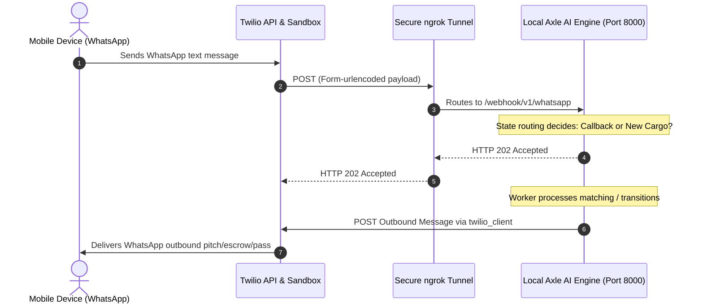

# Axle AI Local Deployment & Twilio Webhook Configuration Guide

This manual describes how to expose the local FastAPI Axle AI execution engine to the public internet using `ngrok`, allowing real-time inbound and outbound WhatsApp messaging over-the-air with a physical phone and Twilio's WhatsApp Sandbox.

---

## Architecture Overview



---

## Step 1: Run the Local FastAPI Server

Start the server using `main.py` (which runs the `uvicorn` server under the hood on port 8000):

```powershell
python main.py
```

You should see output similar to this, indicating the server is alive locally:
```text
INFO:     Started server process [23450]
INFO:     Waiting for application startup.
INFO:     Application startup complete.
INFO:     Uvicorn running on http://0.0.0.0:8000 (Press CTRL+C to quit)
```

Verify it is running locally by opening a web browser or using `curl`:
```powershell
curl http://localhost:8000/health
# Expected: {"status":"healthy","service":"Axle AI Engine"}
```

---

## Step 2: Establish a Secure Public Tunnel with ngrok

You can set up your public network tunnel either automatically using our built-in infrastructure script or manually.

### Option A: Automatic Setup (Recommended)
Run our automated gateway exposure script. It verifies that Uvicorn is active, launches `ngrok` in the background, extracts the HTTPS forwarding URL programmatically, and displays the ready-to-use Twilio Sandbox webhook configuration:

```powershell
python src/gateway_launcher.py
```

### Option B: Manual Setup
If you prefer running ngrok manually:
1. Download and install `ngrok` (from [ngrok.com](https://ngrok.com/)).
2. Authenticate your ngrok client using your auth token:
   ```powershell
   ngrok config add-authtoken <YOUR_NGROK_AUTHTOKEN>
   ```
3. Initialize the tunnel:
   ```powershell
   ngrok http 8000
   ```

ngrok will output a dashboard containing your unique public URL, for example:
```text
Session Status                online
Account                       Your Name (user_xxxx)
Forwarding                    https://a1b2-34-56-78-90.ngrok-free.app -> http://localhost:8000
```

> [!IMPORTANT]
> Copy the secure **HTTPS Forwarding URL** (e.g. `https://a1b2-34-56-78-90.ngrok-free.app`).

---

## Step 3: Configure Twilio WhatsApp Sandbox Webhook

To connect your phone to the local environment via the Sandbox:

1. Log in to the [Twilio Console](https://console.twilio.com/).
2. Navigate to **Messaging** > **Try it out** > **Send a WhatsApp Message**.
3. Activate the Sandbox on your mobile device by scanning the QR code or sending the specified opt-in code (e.g., `join code-word`) to Twilio's Sandbox number: **`+1 415 523 8886`** (WhatsApp contact).
4. Navigate to **Messaging** > **Settings** > **WhatsApp Sandbox Settings**.
5. Locate the **Sandbox Configuration** form.
6. In the **"When a message comes in"** text field, paste your copied ngrok HTTPS URL (or the URL printed by `gateway_launcher.py`) and append the production webhook endpoint:
   ```text
   https://a1b2-34-56-78-90.ngrok-free.app/webhook/v1/whatsapp
   ```
7. Set the HTTP request method dropdown next to it to **`POST`** (Twilio dispatches this request as an `application/x-www-form-urlencoded` Form payload).
8. Click **Save** at the bottom of the page.

---

## Step 4: Interactive Local Sandbox Simulator

If you do not have a physical Twilio phone line configured yet, you can run our interactive command-line test simulator to test all webhook routing and status updates locally or via ngrok forwarding:

```powershell
python src/sandbox_simulator.py
```

This interactive utility mimics Twilio's form-urlencoded payload structure. It allows you to:
- Key in unstructured cargo requests (e.g. "Need flatbed from Chicago...") or state callbacks ("CONFIRM" or "APPROVE").
- Override the sender phone number (defaults to `whatsapp:+15559876543`).
- View beautifully framed immediate response JSON outputs showing the exact routing path inside the Axle AI engine.

---

## Step 5: Over-the-Air Messaging Demo Walkthrough

Now that your local engine is connected to the live airwaves, send actual WhatsApp messages to test:

### 1. Ingest a New Cargo Request
Send an unstructured text message from your phone to the Twilio number (e.g., `whatsapp:+14155238886`):
> "Yo! I have 18 tons of copper wire to ship from Chicago, IL to Los Angeles, CA. My budget is $5200. Can we book a Flatbed?"

- **Twilio** will dispatch a form-urlencoded POST request to `/webhook/v1/whatsapp`.
- **FastAPI** will receive it, detect that your phone number is not linked to any active unconfirmed bookings, and route the text to `process_cargo_request_task`.
- **The Matcher** will find the closest flatbed (`V-CHI-002`), create a booking in `PENDING_DISPATCH` state, and save your phone number as `shipper_id`.
- **The Worker** will send simulated or real outbound WhatsApp messages to both you (shipper quote) and the driver (dispatch offer).

### 2. Confirm the Booking (as the Driver)
In a real deployment, a driver receives the dispatch offer. For sandbox testing, let's say the driver is `V-CHI-001`.
If you set the environment variable `TWILIO_FROM_NUMBER='whatsapp:+14155238886'` and credentials, you can receive live SMS/WhatsApp messages.
To simulate a driver sending `CONFIRM`:
Send a message from the driver's phone (which must be seeded in the DB, e.g. `whatsapp:+15551110001` or simulated in tests) containing:
> "CONFIRM"

- The engine detects that this number belongs to driver of `V-CHI-001` who has a pending booking, and routes it to `process_callback_reply_task`.
- The booking status transitions to `CONFIRMED`, and a digital gate pass WhatsApp is dispatched back to the driver.

### 3. Approve and Pay (as the Shipper)
From your shipper phone, send:
> "APPROVE"

- The engine routes this shipper message to `process_callback_reply_task`.
- The booking transitions to `ESCROW_AUTHORIZED`, triggering payment capture and final scheduling confirmation.
